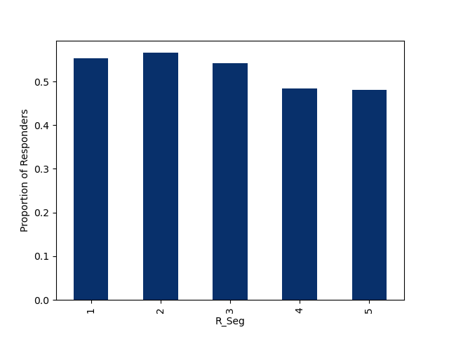
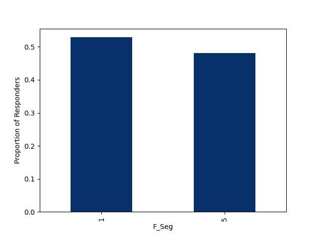
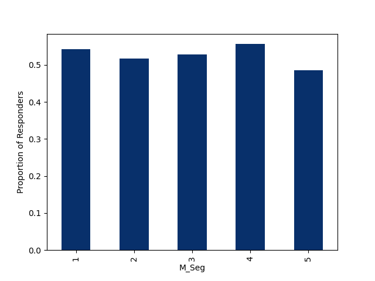

# RFM Segmentation & Marketing Response-Rate Analysis (Retail Transactions)

## What this project does
This small project builds **RFM (Recency / Frequency / Monetary)** features from retail transaction logs, segments customers into tiers, and merges the segments with a campaign **response** label to compare average response rates across customer groups. It’s an interpretable baseline used to quickly check which R/F/M dimension is more sensitive to response and which tiers are more promising for targeting.

## Data
- `Retail_Data_Transactions.csv`: transaction records (`customer_id`, `trans_date`, `tran_amount`, etc.)
- `Retail_Data_Response.csv`: customer response labels (`customer_id`, `response`)

## Approach
1. Use `2016-12-24` as the reference date and compute `hist` = days since each transaction  
2. Keep transactions from the last 2 years to reduce outdated behavioral noise  
3. Aggregate by `customer_id` to obtain:
   - **recency**: days since the most recent purchase (min `hist`)
   - **frequency**: number of transactions
   - **monetary**: total spending
4. Apply quantile binning (20/40/60/80%) to create `R_Seg / F_Seg / M_Seg`
5. Combine the bins into an `RFMScore`, then merge with `response`
6. Plot average response rate by `R_Seg`, `F_Seg`, and `M_Seg` for comparison

## Outputs
- A customer-level table with `recency / frequency / monetary` and segment labels (`R_Seg / F_Seg / M_Seg / RFMScore`)
- Three bar charts showing average response rate by `R_Seg`, `F_Seg`, and `M_Seg`

### Recency vs Response

### Frequency vs Response

### Monetary vs Response

## Notes / Extensions
This repo focuses on segmentation + response-rate checks as a transparent baseline. A natural next step would be adding time-based splits, richer behavioral features, and training a response prediction model with proper evaluation (e.g., AUC/PR-AUC, Recall@K).
